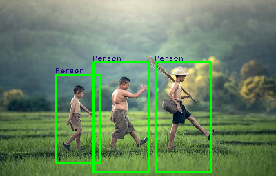

# Human Detection using HOG and SVM

[](https://colab.research.google.com/github/ranjanchoubey/human-detection/blob/master/notebook.ipynb)

## Overview
This project implements a human detection system using Histogram of Oriented Gradients (HOG) for feature extraction and Support Vector Machine (SVM) for classification. The system can detect human figures in images through a sliding window approach combined with image pyramids.

## Project Highlights
- Feature extraction using HOG descriptors
- Classification using Linear SVM
- Sliding window detection with image pyramids
- Non-maximum suppression for overlapping detections
- Real-time human detection capabilities

## Prerequisites
- Python 3.x
- OpenCV
- scikit-learn
- scikit-image
- NumPy
- Matplotlib
- imutils
- joblib

## Installation
```bash
git clone https://github.com/ranjanchoubey/human-detection/
cd human-detection
pip install -r requirements.txt
```

## Project Structure
```
human-detection/
├── assets/
│   ├── image.png
│   └── bolt.jpg
├── dataset/
│   ├── positive/    # Contains human images
│   └── negative/    # Contains non-human images
├── models/
│   └── models.dat   # Trained SVM model
├── notebook.ipynb
└── README.md
```

## How It Works

### 1. Feature Extraction
- Uses HOG (Histogram of Oriented Gradients) for feature extraction
- Parameters:
  - Orientations: 9
  - Pixels per cell: (8, 8)
  - Cells per block: (3, 3)

### 2. Training Process
- Loads positive samples (human images) and negative samples (non-human images)
- Resizes images to 64x128 pixels
- Extracts HOG features from all samples
- Trains a Linear SVM classifier
- Saves the trained model for later use

### 3. Detection Process
- Implements sliding window technique
- Uses image pyramids for multi-scale detection
- Applies non-maximum suppression to remove overlapping detections
- Parameters:
  - Window size: (64, 128)
  - Step size: (9, 9)
  - Downscale factor: 1.25

### 4. Visualization
- Draws bounding boxes around detected humans
- Labels detections with confidence scores
- Uses green rectangles for visualization

## Usage
1. Open the notebook in Google Colab using the badge above
2. Run all cells sequentially
3. The final cell will process a test image and display results

## Example Output
### Human Detection Results
The system successfully detects human figures in images by:
- Drawing bounding boxes around detected humans (green rectangles)
- Labeling each detection with confidence scores
- Handling different poses and scales effectively

Additional detection examples:
| Original Image | Detection Result |
|----------------|------------------|
|  |   |

## Resources
### Project Presentation
The comprehensive project presentation covers:
- Detailed technical implementation of HOG and SVM
- Step-by-step explanation of the detection pipeline
- Performance analysis and benchmarks
- Real-world application examples
- Future enhancements and possibilities

Access the presentation here: [Human Detection Project Presentation](https://docs.google.com/presentation/d/1ebIDe_9QLxQUTOizuFgAEadjVxefgUBD/edit?usp=drive_link&ouid=102222658965169638537&rtpof=true&sd=true)

### Additional Resources
- Sample results are available in the `assets` directory
- Dataset examples and organization guidelines
- Model configuration templates

## Performance Considerations
- Detection speed depends on:
  - Image size
  - Step size
  - Number of pyramid levels
- Adjust parameters based on your specific needs:
  - Smaller step size = More accurate but slower
  - Larger downscale factor = Faster but might miss detections

